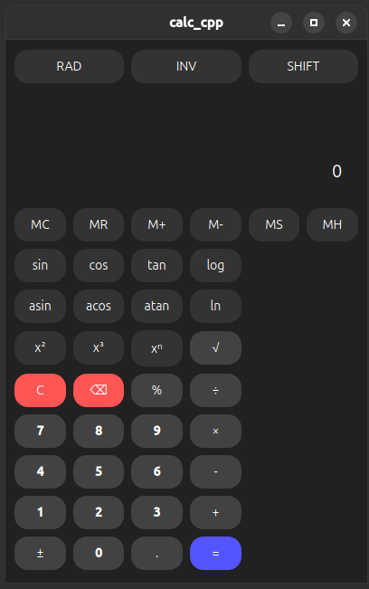

# Advanced Scientific Calculator

An advanced scientific calculator application built with Qt Framework in C++. It supports basic arithmetic operations, scientific functions, and memory operations with an intuitive user interface.

## Features

- **Basic Operations**: Addition, subtraction, multiplication, division, and percentage.
- **Scientific Functions**:
    - **Trigonometric**: sin, cos, tan, and their inverse functions (asin, acos, atan).
    - **Exponentiation**: Square, cube, nth power, and square root.
    - **Logarithmic**: log (base 10) and natural logarithm (ln).
    - **Angle Modes**: Toggle between Radian and Degree mode.
- **Memory Operations**:
    - Store (MS), recall (MR), clear (MC), add (M+), and subtract (M-) values in memory.
- **Error Handling**: Prevents invalid inputs like division by zero.
- **History Tracking**: Stores the results of recent calculations.
- **Shift Mode**: Access secondary functions (like power operations).
- **Dark Theme**: A visually appealing UI with a dark theme for better usability.

## Screenshots



## Getting Started

Follow these steps to set up and run the application:

### Prerequisites

- Qt Framework (e.g., Qt 5 or Qt 6)
- A C++ compiler compatible with Qt (e.g., GCC, MSVC)

### Installation

Clone the repository:

```bash
git clone https://github.com/your-username/scientific-calculator.git
cd scientific-calculator
```

Open the project in Qt Creator:

1. Launch Qt Creator.
2. Open the `scientific-calculator.pro` file.

Build the project:

1. Select the appropriate kit (e.g., Desktop Qt 6.x GCC).
2. Click the Run button to build and execute the application.

## Usage

- Launch the calculator.
- Perform basic and scientific calculations using the buttons.
- Toggle between Radian and Degree mode using the RAD/DEG button.
- Use SHIFT to access advanced functions.
- Manage stored values using the memory buttons (MC, MR, etc.).

## Code Structure

- **MainWindow Class**: Manages the UI and logic of the calculator.
    - `setupUI()`: Configures the user interface layout.
    - `createButton()`: Creates reusable button components.
    - `numberPressed()`: Handles number and decimal point input.
    - `operatorPressed()`: Handles arithmetic operators.
    - `scientificOperatorPressed()`: Handles scientific function buttons.
    - `memoryPressed()`: Handles memory operations.
    - Other utility methods for clearing, backspacing, and updating the display.

## Future Improvements

- Add support for additional scientific functions.
- Include a graphing mode for plotting equations.
- Implement keyboard shortcuts for faster input.
- Optimize the layout for different screen sizes.

## Contributing

Contributions are welcome! Feel free to open issues or submit pull requests to improve the project.

## Contact

For any queries or feedback, feel free to reach out:

- **Email**: 144singhsarthak@gmail.com
- **GitHub**: [sarthakk1890](https://github.com/sarthakk1890)
